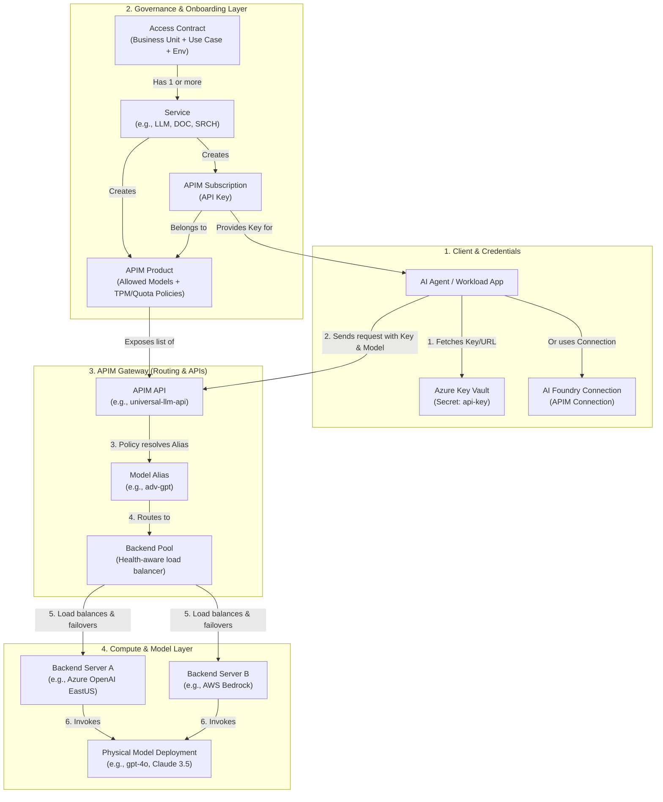

# 🗺️ Citadel Governance Model: Concepts & Relationships

This document provides a conceptual guide explaining the relationship between **Access Contracts**, **Services**, **APIM Products**, **APIM Subscriptions**, and how they map down to **Backend Servers** and **AI Models** within the Citadel AI Hub Gateway.

---

## 1. Conceptual Architecture & Relationship Diagram

The following diagram illustrates how a client's request flow traverses the Citadel governance layers down to the physical AI models:

---

## 2. Element Definitions and Mappings

| Element | Level | Description | Mapping / Implementation in Bicep |
| :--- | :--- | :--- | :--- |
| **Access Contract** | Logical / Governance | An agreement representing a specific usecase workload (e.g., `Sales-Assistant`) within a business unit and environment. | Represented by the `useCase` parameter in `.bicepparam` (defines BU, UseCaseName, and Environment). |
| **Service** | Parameter / Package | A logical category of AI capabilities (e.g., `LLM` for LLMs, `DOC` for document processing). | Declared under the `services` array in Bicep parameter files. Maps to `apiNameMapping` to determine which APIs are included. |
| **APIM Product** | APIM Resource | The security and governance boundary in APIM (`Microsoft.ApiManagement/service/products`). It holds custom policies (TPM limit, monthly tokens quota, and allowed models list). | Named `<serviceCode>-<BU>-<UseCase>-<ENV>` (e.g., `LLM-Sales-Assistant-DEV`). Created by Bicep. |
| **APIM Subscription** | APIM Resource | A subscription created under the product that generates the unique client `api-key`. | Named `<product>-SUB-01`. Key is saved to Key Vault or mapped into AI Foundry Connection. |
| **APIM API** | Gateway Endpoint | The specific URL gateway endpoint path (e.g. `/models` or `/formrecognizer`). | Included dynamically in the APIM Product based on the Service Mapping. |
| **Model Alias** | Routing Policy | A stable nickname for a model (e.g. `adv-gpt`) requested by clients. APIM policy resolves this into real model names at runtime. | Declared in the Model Onboarding configuration; managed by the `resolve-model-alias` fragment. |
| **Backend Pool** | Failover / LB | A group of physical backend servers hosting the same model. | Created in APIM when multiple endpoints support the same model. Handles routing and circuit breakers. |
| **Backend Server** | Compute Resource | The actual deployed instance of the AI service (Azure OpenAI, AWS Bedrock, AI Foundry). | Created as `Microsoft.ApiManagement/service/backends`. |
| **Physical Model** | Compute / Model | The actual model processing requests (e.g. `gpt-4o`, `Mistral-Large-3`). | Deployed on the physical backend servers. |

---

## 3. Detailed Relationships Explained

### 1️⃣ Access Contract ➔ Services
An **Access Contract** is the overall request envelope. For a single application workload, it can request access to multiple **Services** (e.g. both `LLM` and `DOC` for a bot that needs to reason and read scanned PDFs). 
* In Bicep, this translates to having multiple items in the `services` array parameter.

### 2️⃣ Service ➔ APIM Product & Subscription
For **every** service item specified in the contract:
* A separate **APIM Product** is provisioned. For example, if a Sales Bot requests `LLM` and `DOC`, Bicep will deploy:
  1. Product `LLM-Sales-Bot-DEV`
  2. Product `DOC-Sales-Bot-DEV`
* A separate **APIM Subscription** is provisioned for each product, generating two distinct API keys (one for LLM, one for Doc Intelligence). This keeps security scopes isolated.

### 3️⃣ APIM Product ➔ APIM APIs
The **Service Mapping** (`apiNameMapping`) bridges the Product to the underlying APIM APIs.
* When Product `LLM-Sales-Bot-DEV` is deployed, Bicep looks up `apiNameMapping.LLM` (which resolves to `['universal-llm-api', 'azure-openai-api']`) and attaches those specific APIs to the product.
* The client credentials (Subscription Key) can only access APIs attached to that Product.

### 4️⃣ Product Policy ➔ Backend Pools & Models
When a client sends a request to the gateway (e.g., calling model `gpt-4o` using the `Sales-Assistant` subscription key):
1. **Model Authorization**: The APIM Product Policy checks if `gpt-4o` is in the `allowedModels` list (enforcing **Model-level RBAC**).
2. **Alias Resolution**: If the client calls an alias like `adv-gpt`, the `resolve-model-alias` fragment maps it to a real model name (e.g. `gpt-4o`).
3. **Backend Selection**: The APIM gateway looks up the **Backend Pool** associated with that model (e.g., `gpt4o-backend-pool`).
4. **Resiliency Routing**: The gateway routes the request to the highest priority, healthy **Backend Server** in the pool (e.g., `azure-openai-eastus`). If that server trips the **Circuit Breaker** (e.g. returns `429 Too Many Requests`), the gateway automatically retries the next backend in the pool.
