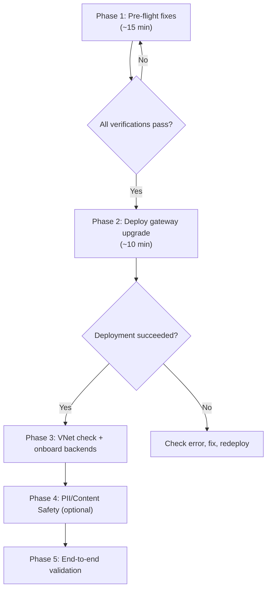

# APIM Gateway Upgrade — Execution Guide for EIST DEV

## Current State Assessment

Your [eist-dev-upgrade-tracker.md](file:///C:/Users/hwang5/Projects/FHA-EIST-AppServices/Smart-KB/projects/ai-hub-gateway-solution-accelerator/bicep/infra/apim-gateway-upgrade/eist-dev-upgrade-tracker.md) shows that **Step 1 failed** and you're blocked at **Step 1a** (pre-flight fixes). Here's the full picture:

| What | Status | Details |
|------|--------|---------|
| Environment assessment | ✅ Done | APIM `apim-eist-dev` exists, Developer SKU, Internal VNet |
| Step 1 deployment | ❌ Failed | Two hard errors blocked it |
| Step 1a pre-flight | ⏳ Not started | Fixes needed before retry |
| Steps 2–7 | ⏳ Pending | Depend on Step 1 success |

### Why it failed (two root causes)

| # | Error | Root Cause | Fix |
|---|-------|-----------|-----|
| 1 | `Logger not found: usage-eventhub-logger` | The `ai-usage` policy fragment unconditionally references an Event Hub logger that doesn't exist on `apim-eist-dev` | Create Event Hub namespace + hub + APIM logger |
| 2 | `Cannot find property 'uami-client-id'` and `'piiServiceUrl'` | The `pii-anonymization` fragment references named values that don't exist yet | Pre-create named values as placeholders |

### Additional constraint: App Insights logger name mismatch
- [main.bicep](file:///C:/Users/hwang5/Projects/FHA-EIST-AppServices/Smart-KB/projects/ai-hub-gateway-solution-accelerator/bicep/infra/apim-gateway-upgrade/main.bicep#L182-L185) hardcodes `appinsights-logger`
- Your APIM has the logger named `appi-eist-apim-dev`
- **Workaround applied**: `updateAppInsightsDiagnostics = false` in [main-eist-dev.bicepparam](file:///C:/Users/hwang5/Projects/FHA-EIST-AppServices/Smart-KB/projects/ai-hub-gateway-solution-accelerator/bicep/infra/apim-gateway-upgrade/main-eist-dev.bicepparam#L119)

---

## Execution Plan — Step by Step

> [!IMPORTANT]
> All commands assume you're in a PowerShell terminal, authenticated via `az login`, and targeting the correct subscription.

### Phase 0 — Authenticate & Set Context

```powershell
az login
az account set --subscription "8ec4d8c8-09af-4f21-8d34-2caa6384fe4e"
az account show --query "{Name:name, SubscriptionId:id, TenantId:tenantId}" -o table
```

---

### Phase 1 — Pre-flight Fixes (Step 1a from tracker)

These must all complete before the main deployment can succeed.

#### 1A. Create missing Named Values

```powershell
# Get UAMI client ID
$uamiClientId = az identity show `
  --name mi-EIST-apim-dev `
  --resource-group RG-EIST-APIM-dev `
  --query clientId -o tsv
Write-Host "UAMI client ID: $uamiClientId"

# Create uami-client-id named value
$uamiBody = @{properties=@{displayName="uami-client-id";secret=$true;value=$uamiClientId}} | ConvertTo-Json -Depth 3 -Compress
$uamiBody | Out-File -Encoding ascii -FilePath body.json

az rest --method put `
  --url "https://management.azure.com/subscriptions/8ec4d8c8-09af-4f21-8d34-2caa6384fe4e/resourceGroups/RG-EIST-APIM-dev/providers/Microsoft.ApiManagement/service/apim-eist-dev/namedValues/uami-client-id?api-version=2022-08-01" `
  --body "@body.json"

# Create piiServiceUrl placeholder
$piiBody = @{properties=@{displayName="piiServiceUrl";secret=$false;value="placeholder"}} | ConvertTo-Json -Depth 3 -Compress
$piiBody | Out-File -Encoding ascii -FilePath pii_body.json

az rest --method put `
  --url "https://management.azure.com/subscriptions/8ec4d8c8-09af-4f21-8d34-2caa6384fe4e/resourceGroups/RG-EIST-APIM-dev/providers/Microsoft.ApiManagement/service/apim-eist-dev/namedValues/piiServiceUrl?api-version=2022-08-01" `
  --body "@pii_body.json"
```

#### 1B. Create Event Hub Namespace + Hub

```powershell
# Create Event Hub namespace
az eventhubs namespace create `
  --name evhns-eist-apim-dev `
  --resource-group RG-EIST-APIM-dev `
  --location canadacentral `
  --sku Standard

# Create the ai-usage hub
az eventhubs eventhub create `
  --name ai-usage `
  --namespace-name evhns-eist-apim-dev `
  --resource-group RG-EIST-APIM-dev `
  --cleanup-policy Delete `
  --retention-time-in-hours 168 `
  --partition-count 4
```

#### 1C. Grant RBAC — Event Hub Data Sender to UAMI

```powershell
$ehNamespaceId = az eventhubs namespace show `
  --name evhns-eist-apim-dev `
  --resource-group RG-EIST-APIM-dev `
  --query id -o tsv

$uamiPrincipalId = az identity show `
  --name mi-EIST-apim-dev `
  --resource-group RG-EIST-APIM-dev `
  --query principalId -o tsv

az role assignment create `
  --role "Azure Event Hubs Data Sender" `
  --assignee-object-id $uamiPrincipalId `
  --assignee-principal-type ServicePrincipal `
  --scope $ehNamespaceId
```

#### 1D. Create APIM Event Hub Logger

```powershell
$uamiClientId = az identity show `
  --name mi-EIST-apim-dev `
  --resource-group RG-EIST-APIM-dev `
  --query clientId -o tsv
# Create usage-eventhub-logger
$loggerBodyObj = @{
    properties = @{
        loggerType = "azureEventHub"
        description = "Event Hub logger for OpenAI usage metrics"
        credentials = @{
            endpointAddress = "evhns-eist-apim-dev.servicebus.windows.net"
            identityClientId = $uamiClientId
            name = "ai-usage"
        }
    }
}
$loggerBody = $loggerBodyObj | ConvertTo-Json -Depth 5 -Compress
$loggerBody | Out-File -Encoding ascii -FilePath logger_body.json

az rest --method put `
  --url "https://management.azure.com/subscriptions/8ec4d8c8-09af-4f21-8d34-2caa6384fe4e/resourceGroups/RG-EIST-APIM-dev/providers/Microsoft.ApiManagement/service/apim-eist-dev/loggers/usage-eventhub-logger?api-version=2022-08-01" `
  --body "@logger_body.json"
```

#### 1E. Verify all prerequisites

```powershell
# Verify logger
az rest --method get `
  --url "https://management.azure.com/subscriptions/8ec4d8c8-09af-4f21-8d34-2caa6384fe4e/resourceGroups/RG-EIST-APIM-dev/providers/Microsoft.ApiManagement/service/apim-eist-dev/loggers/usage-eventhub-logger?api-version=2022-08-01" `
  --query "properties.loggerType" -o tsv
# Expected: azureEventHub

# Verify named values
az rest --method get `
  --url "https://management.azure.com/subscriptions/8ec4d8c8-09af-4f21-8d34-2caa6384fe4e/resourceGroups/RG-EIST-APIM-dev/providers/Microsoft.ApiManagement/service/apim-eist-dev/namedValues?api-version=2022-08-01" `
  --query "value[].name" -o table
# Expected: includes uami-client-id, piiServiceUrl
```

> [!CAUTION]
> Do NOT proceed to Phase 2 until all verifications pass. If the Event Hub logger shows an error, check that the RBAC assignment has propagated (can take a few minutes).

---

### Phase 2 — Run the Gateway Upgrade Deployment

```powershell
az deployment group create `
  --name gateway-upgrade-eist-dev-$(Get-Date -Format "yyyyMMddHHmm") `
  --resource-group RG-EIST-APIM-dev `
  --template-file bicep/infra/apim-gateway-upgrade/main.bicep `
  --parameters bicep/infra/apim-gateway-upgrade/main-eist-dev.bicepparam
```

**What this deploys** (based on current [main-eist-dev.bicepparam](file:///C:/Users/hwang5/Projects/FHA-EIST-AppServices/Smart-KB/projects/ai-hub-gateway-solution-accelerator/bicep/infra/apim-gateway-upgrade/main-eist-dev.bicepparam)):

| Component | Deployed? | Notes |
|-----------|-----------|-------|
| Named values (`uami-client-id`, `contentSafetyServiceUrl`, JWT) | ✅ Yes | `updateNamedValues = true`, `updateJwtNamedValues = true` |
| Static policy fragments | ✅ Yes | `updatePolicyFragments = true` |
| Universal LLM API | ✅ Yes | `updateUniversalLLMApi = true` |
| Azure OpenAI API | ✅ Yes | `updateAzureOpenAIApi = true` |
| Unified AI Wildcard API | ✅ Yes | `updateUnifiedAiApi = true` |
| LLM backends/pools | ❌ Skipped | VNet connectivity not verified |
| App Insights diagnostics | ❌ Skipped | Logger name mismatch |
| Redis / Embeddings | ❌ Skipped | Not configured |

#### Verify deployment

```powershell
# Check APIs were created
az rest --method get `
  --url "https://management.azure.com/subscriptions/8ec4d8c8-09af-4f21-8d34-2caa6384fe4e/resourceGroups/RG-EIST-APIM-dev/providers/Microsoft.ApiManagement/service/apim-eist-dev/apis?api-version=2022-08-01" `
  --query "value[].name" -o table

# Check policy fragments
az rest --method get `
  --url "https://management.azure.com/subscriptions/8ec4d8c8-09af-4f21-8d34-2caa6384fe4e/resourceGroups/RG-EIST-APIM-dev/providers/Microsoft.ApiManagement/service/apim-eist-dev/policyFragments?api-version=2022-08-01" `
  --query "value[].name" -o table
```

---

### Phase 3 — Verify VNet Connectivity & Onboard LLM Backends

> [!IMPORTANT]
> This is the critical step that makes the gateway actually functional.

#### 3A. Determine your LLM endpoints

Answer these questions first:
- What Azure OpenAI / AI Foundry endpoints do you have?
- Are they exposed via private endpoint into the same VNet as `apim-eist-dev`?
- Or does the VNet have outbound internet for public endpoints?

#### 3B. Test connectivity (from a VM inside the VNet)

```bash
curl -I https://<your-foundry-or-aoai-endpoint>.cognitiveservices.azure.com/
```

#### 3C. Update param file and redeploy

Once connectivity is confirmed, edit [main-eist-dev.bicepparam](file:///C:/Users/hwang5/Projects/FHA-EIST-AppServices/Smart-KB/projects/ai-hub-gateway-solution-accelerator/bicep/infra/apim-gateway-upgrade/main-eist-dev.bicepparam#L59-L78):

```bicep
param updateLLMBackends        = true
param updateLLMBackendPools    = true
param updateLLMPolicyFragments = true

param llmBackendConfig = [
  {
    backendId: 'aif-eist-dev-0'
    backendType: 'ai-foundry'             // or 'azure-openai'
    endpoint: 'https://<your-endpoint>.cognitiveservices.azure.com/'
    authType: 'managed-identity'
    priority: 1
    weight: 100
    supportedModels: [
      { name: 'gpt-4o', sku: 'GlobalStandard', capacity: 100, modelFormat: 'OpenAI', modelVersion: '2024-11-20' }
    ]
  }
]
```

Then grant RBAC on the LLM endpoint:

```powershell
# For AI Foundry
az role assignment create `
  --role "Cognitive Services User" `
  --assignee-object-id $uamiPrincipalId `
  --assignee-principal-type ServicePrincipal `
  --scope "/subscriptions/<sub>/resourceGroups/<rg>/providers/Microsoft.CognitiveServices/accounts/<foundry-name>"
```

Redeploy:

```powershell
az deployment group create `
  --name gateway-upgrade-eist-dev-backends-$(Get-Date -Format "yyyyMMddHHmm") `
  --resource-group RG-EIST-APIM-dev `
  --template-file bicep/infra/apim-gateway-upgrade/main.bicep `
  --parameters bicep/infra/apim-gateway-upgrade/main-eist-dev.bicepparam
```

---

### Phase 4 — Configure PII & Content Safety (Optional)

Once you have an AI Foundry / Language Service endpoint, update the param file:

```bicep
param enablePIIAnonymization  = true
param aiLanguageServiceUrl    = 'https://<your-foundry>.cognitiveservices.azure.com/'
param contentSafetyServiceUrl = 'https://<your-foundry>.cognitiveservices.azure.com/'
```

Redeploy with the same command.

---

### Phase 5 — End-to-End Validation

```powershell
# Test a chat completion request
curl -X POST https://apim-eist-dev.azure-api.net/openai/deployments/gpt-4o/chat/completions?api-version=2024-02-15-preview `
  -H "api-key: <subscription-key>" `
  -H "Content-Type: application/json" `
  -d '{"messages":[{"role":"user","content":"hello"}]}'
```

Or use the validation notebooks:
- [citadel-unified-ai-api-tests.ipynb](file:///C:/Users/hwang5/Projects/FHA-EIST-AppServices/Smart-KB/projects/ai-hub-gateway-solution-accelerator/validation/citadel-unified-ai-api-tests.ipynb)
- [citadel-agent-frameworks-tests.ipynb](file:///C:/Users/hwang5/Projects/FHA-EIST-AppServices/Smart-KB/projects/ai-hub-gateway-solution-accelerator/validation/citadel-agent-frameworks-tests.ipynb)

---

## Known Issues to Fix in Code (Optional Improvements)

These are design gaps in the upgrade template that caused the initial failure:

| Issue | File | Description | Suggested Fix |
|-------|------|-------------|---------------|
| Event Hub logger not provisioned | [main.bicep](file:///C:/Users/hwang5/Projects/FHA-EIST-AppServices/Smart-KB/projects/ai-hub-gateway-solution-accelerator/bicep/infra/apim-gateway-upgrade/main.bicep) | `ai-usage` policy fragment assumes `usage-eventhub-logger` exists, but the upgrade path never creates it | Add optional Event Hub logger provisioning or make the fragment conditional |
| App Insights logger name hardcoded | [main.bicep:L183](file:///C:/Users/hwang5/Projects/FHA-EIST-AppServices/Smart-KB/projects/ai-hub-gateway-solution-accelerator/bicep/infra/apim-gateway-upgrade/main.bicep#L183) | Hardcoded to `appinsights-logger`; existing APIM uses `appi-eist-apim-dev` | Parameterize the logger name |
| PII fragment deployed unconditionally | Policy fragments module | Fragment XML references named values even when `enablePIIAnonymization = false` | Gate fragment deployment on the enable flag |
| `pii-state-saving` uses wrong logger | `frag-pii-state-saving.xml` | Hardcodes `pii-usage-eventhub-logger` instead of `usage-eventhub-logger` | Update XML logger-id reference |
| Backend URL validation fails | `main.bicep` | Passing empty string or "placeholder" to Backend URL fails validation | Use `https://placeholder.com` for inactive backends |
| Hardcoded fragment dependencies | API policy XMLs | `unified-ai-api` and `universal-llm-api` hardcode `ai-foundry-compatibility` fragment | Make fragment include conditional or deploy fragment unconditionally |

---

## Quick Reference: What to Do RIGHT NOW



**Start with Phase 1** — run the PowerShell commands above in order. The whole pre-flight should take about 15 minutes (Event Hub namespace creation is the longest step).
